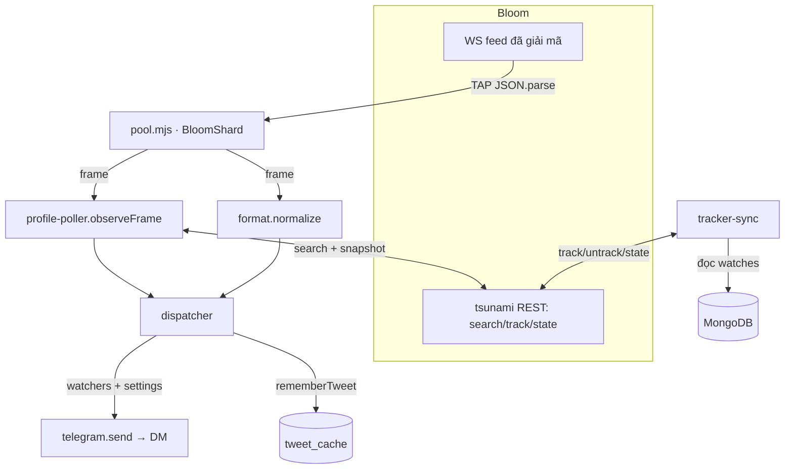

# Kiến trúc — BE (engine)

> **Vai trò:** đọc feed X đã giải mã từ Bloom, chuẩn hoá thành event, lọc theo watch-list +
> settings của từng user, rồi **gửi DM** thẳng cho user đúng format channel nguồn. Cũng lo
> đồng bộ danh sách account cần track lên tài khoản Bloom, tự dò đổi profile, và rollup thống kê.

- **Entry:** [`be/engine.mjs`](../be/engine.mjs) — `npm run be` / pm2 `kol-be`
- **Phụ thuộc:** Playwright (Chromium thật — qua quantum PoW của Bloom), MongoDB Atlas, Telegram Bot API (chỉ để **gửi**).



---

## Bản đồ file

| File | Trách nhiệm |
|---|---|
| [`be/engine.mjs`](../be/engine.mjs) | Entry. Bật pool + dispatcher + tracker-sync + profile-poller + rollup `user_stats` (60s). Warmup nuốt backlog. |
| [`be/pool.mjs`](../be/pool.mjs) | `BloomShard` = 1 Playwright persistent context / tài khoản Bloom; patch `JSON.parse` để tap frame WS. `BloomPool` quản N shard. |
| [`be/lib/format.mjs`](../be/lib/format.mjs) | `normalize(frame)` → event thống nhất; `buildMessage(e)` → `{text, link_preview_options, reply_markup}`; `makeProfileEvent`. |
| [`be/dispatcher.mjs`](../be/dispatcher.mjs) | event → watchers → lọc settings/media → dedup → gửi DM. |
| [`be/tracker-sync.mjs`](../be/tracker-sync.mjs) | Reconcile `union(watches.handle)` ↔ pool Bloom. Self-heal + exclusive. |
| [`be/profile-poller.mjs`](../be/profile-poller.mjs) | Dò đổi avatar/name/verified (feed-driven + poll). |
| [`be/tweet-cache.mjs`](../be/tweet-cache.mjs) | `rememberTweet` / `enrichDelete` (render tin đã xoá). |
| [`be/lib/tsunami.mjs`](../be/lib/tsunami.mjs) | Client REST mã hoá của Bloom (AES-256-GCM). |
| [`be/lib/telegram.mjs`](../be/lib/telegram.mjs) | Sender: hàng đợi per-chat + rate-limit + retry. |

---

## Pipeline chính

```
frame WS (Bloom) → normalize → [rememberTweet] → resolveHandle → warmup gate
   → KIND_TO_COL → dedupKey → watchersOfHandle → mỗi user: lọc settings + media
   → buildMessage → telegram.send (delete = ưu tiên)
```

### 1. Ingest — `pool.mjs`
- Mỗi tài khoản Bloom (`bloom_accounts`) = **1 shard** = 1 Chromium persistent context (`state/profile-<id>`), inject cookie session.
- `TAP_INIT` patch `JSON.parse`: frame nào có `type ∈ WANT` thì đẩy qua `window.__tap`.
  `WANT = {tweet, retweet, quote, reply, compliance, activity, enrichment}`.
- Session redirect `/login` → shard `expired`, alert admin, **chỉ shard đó chết** (pool vẫn chạy).

### 2. Normalize — `format.normalize`
| Frame `type` | → event `kind` |
|---|---|
| `tweet` (sub-type ở `data.type`) | `tweet` / `retweet` / `reply` / `quote` |
| `compliance` `delete` | `deleted` (+ `deletedIsRetweet`) |
| `compliance` `user_suspend/delete` | `suspended` / `deactivated` |
| `activity` `follow.follow/unfollow` | `followed` / `unfollowed` (+ profile card từ `change.after/before`) |
| `activity` `profile.update.*` | `profileChanges` / `affiliation` (`makeProfileEvent`) |
| `enrichment` | (CA/token — hiện chưa dựng tin) |

> Actor của follow/profile **không có** trong frame (chỉ `user_id`) → dispatcher resolve handle
> từ `authorId` qua `tracked_handles`.

### 3. Dispatch — `dispatcher.mjs`
1. `rememberTweet(e)` → cache mọi tweet-like (cho render delete).
2. `deleted` → `enrichDelete` (đọc nội dung gốc từ cache).
3. `resolveHandle` (actor hoặc `getTrackedByXid`) → nếu không có → bỏ.
4. Warmup gate: `Date.now() < warmupUntil` → nuốt (tránh spam lúc mới connect).
5. `KIND_TO_COL[kind]` → cột setting; `dedupKey(e)` ổn định.
6. `watchersOfHandle` → mỗi user:
   - `settings[colKey]` off → bỏ.
   - `markDelivered(key, tgId)` — chống gửi trùng (TTL 2 ngày).
   - `applyMediaFilter` (tắt photos/videos → gỡ media).
   - `buildMessage(ev, {botUser, deleteButton})`.
   - `tg.send(tgId, msg, {priority: kind==="deleted"})`.

### 4. Format tin — `buildMessage`
Prefix `[media][action]` + head + body + preview qua `link_preview_options.url` (không nhét link vào text).
Bám [`send_like_source.md`](send_like_source.md). Nút: 🗑 Delete (theo setting `delete_button`) + View Tweet / View Followed Account / QA.

---

## Đồng bộ tracker — `tracker-sync.mjs` (mỗi 20s)
1. `desired = distinct(watches.handle)`. Untrack handle `ref_count=0`; re-home handle của shard chết.
2. Handle mới → chọn shard còn chỗ (`capacity - load`) → `search` (lấy `x_user_id`) → `trackNames` → ghi `tracked_handles`.
3. **Đối chiếu state THẬT của Bloom** (fetch `/api/twitter/state`):
   - **Self-heal:** handle desired **không visible** trên Bloom (track fail âm thầm / sót session cũ) → **track lại**.
   - **Exclusive** (`SOURCE_EXCLUSIVE=1`): untrack account **không ai watch** (dọn ~1300 default của Bloom → feed nhẹ ~70×).
4. Pool đầy / session hết hạn → alert admin.

---

## Dò đổi profile — `profile-poller.mjs`
Tracker-state của Bloom cập nhật quá chậm để phát `profile.update` kịp → tự dò:
- **Feed-driven (real-time, 0 request):** mỗi tweet-like mang `author.profile_image_url` tươi →
  `observe` diff avatar/name vs snapshot in-memory → bắn `profileChanges` ngay.
- **Poll fallback (`PROFILE_POLL_MS`, mặc định 2 phút):** batch-search mọi handle → diff avatar/name/verified
  vs `profile_snap` → bắn cho account **im lặng** (và verified badge).
- **Chuẩn hoá avatar** (`canonAvatar`): bỏ hậu tố kích cỡ (`_normal`/`_400x400`…) trước khi so — nếu không sẽ
  ping-pong vô hạn giữa feed (`_400x400`) và search (`_normal`).
- Lần đầu thấy handle → seed im lặng; dedup `pc:xid:field:value`.

---

## Gửi Telegram — `lib/telegram.mjs`
- Hàng đợi **per-chat**, giãn ~1.1s/tin (né rate-limit per-chat).
- `429` → chờ `retry_after` rồi thử lại.
- Lỗi mạng tạm thời (`fetch failed`…) → nhét lại đầu hàng, backoff, tối đa 5 lần (không nuốt mất noti).
- `priority` → chen đầu hàng (delete không phải đợi sau đống tweet).

---

## Shared & DB

`shared/`: [`config.mjs`](../shared/config.mjs) (nạp `.env` → `cfg`), [`mongo.mjs`](../shared/mongo.mjs)
(`connect/col/now` + index), [`repo.mjs`](../shared/repo.mjs) (DAL), [`settings.mjs`](../shared/settings.mjs)
(metadata toggle + `KIND_TO_COL` + `DEFAULTS`), [`migrate.mjs`](../shared/migrate.mjs).

### Collections
| Collection | Khoá | Nội dung |
|---|---|---|
| `users` | `tg_id` | tier, account_limit, expires_at, points, `settings{…}` |
| `watches` | `tg_id+handle` | handle, x_user_id, `settings`(null=kế thừa global) |
| `referrals` | `referrer+referred` | subscribed |
| `bloom_accounts` | `id` | label, session_token, capacity, status |
| `tracked_handles` | `handle` | x_user_id, bloom_account_id, ref_count, last_event_at |
| `tweet_cache` | `tweet_id` | text, media, is_retweet · **TTL 3 ngày** |
| `deliveries` | key+tgId | chống gửi trùng · **TTL 2 ngày** |
| `profile_snap` | `handle` | avatar/name/verified (baseline cho poller) |
| `user_stats` | `tg_id` / `__totals__` | rollup: mỗi user add bao nhiêu account (ngoài default) |

`settings` (trong `users`/`watches`): 1 blob các cột bật/tắt. `settingsOf` merge `DEFAULTS` nên key
thiếu tự lấy default. `effectiveSettings` = override của watch nếu có, else global.

---

## Cấu hình (env) liên quan BE
`BLOOM_SESSIONS` (mỗi token = 1 shard) · `BLOOM_CAPACITY` (trần ~3000/tài khoản Bloom) ·
`SOURCE_EXCLUSIVE` · `HEADLESS` · `WARMUP_MS` · `PROFILE_POLL` · `PROFILE_POLL_MS` ·
`MONGODB_URI` · `BOT_TOKEN` (để gửi DM) · `ADMIN_IDS`.

## Ràng buộc / failure modes
- **Session Bloom ~30 ngày hết hạn** → shard `expired`, alert admin; đổi token → `scripts/reset_source.mjs` → restart.
- **Quantum PoW cần Chromium thật** → mỗi shard ≈ 400MB RAM; giới hạn số shard theo VPS.
- **Atlas hiccup** → sender/Mongo có retry; nếu vẫn crash thì pm2 restart.
- **5 feature Bloom không phát** (pins/unpins/spaces/trending×2) → gate ở FE, không hứa.
- Chạy **1 BE duy nhất** trên 1 DB (2 BE = gửi noti 2 lần, track chồng).
