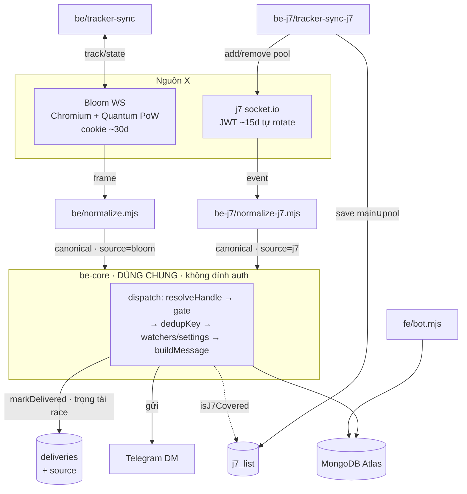

# Kiến trúc — Dual-source BE (Bloom + j7)

> **Vai trò:** đọc feed X từ **2 nguồn song song** — [Bloom](../be/engine.mjs) (Chromium+PoW) và
> [j7tracker](../be-j7/engine-j7.mjs) (socket JWT) — chuẩn hoá về **1 canonical event**, rồi qua tầng
> **dùng chung** [`be-core/`](../be-core) để lọc watch-list/settings và **gửi DM**. Hai nguồn **đua nhau**:
> event nào (cùng khoá) tới trước thì gửi, nguồn sau tự bỏ (không trùng). Mục tiêu: **hạ độ trễ**
> (j7 nhẹ, thường nhanh hơn) + **bù tính năng** (pins/unpins chỉ j7; edits/compliance sâu chỉ Bloom).

- **3 process:** [`be/engine.mjs`](../be/engine.mjs) (kol-be) · [`be-j7/engine-j7.mjs`](../be-j7/engine-j7.mjs) (kol-be-j7) · [`fe/bot.mjs`](../fe/bot.mjs) (kol-fe)
- FE và cả 2 BE **chỉ gặp nhau ở MongoDB**. 2 BE **chỉ gửi** (không poll updates) → chạy song song không đụng 409.
- Chi tiết nguồn Bloom: [ARCHITECTURE_BE.md](ARCHITECTURE_BE.md) · j7 gốc: repo research `j7-kol-router` (ngoài repo này).



---

## Bản đồ file

### `be-core/` — tầng dùng chung (cả 2 BE import; FE KHÔNG đụng)
| File | Trách nhiệm |
|---|---|
| [`dispatch.mjs`](../be-core/dispatch.mjs) | canonical event → resolveHandle → **gate source-preference** → dedupKey → watchers + lọc settings → buildMessage → `markDelivered` (race) → gửi. |
| [`message.mjs`](../be-core/message.mjs) | `buildMessage` (render tin, dùng chung → ai thắng cũng ra tin **giống hệt**) + `makeProfileEvent`. |
| [`events.mjs`](../be-core/events.mjs) | `dedupKey(e)` — khoá ổn định để 2 nguồn khớp nhau (race). |
| [`tweet-cache.mjs`](../be-core/tweet-cache.mjs) | `rememberTweet`/`enrichDelete` — cache chung để render tin đã xoá. |
| [`telegram.mjs`](../be-core/telegram.mjs) | Sender per-chat + rate-limit + retry (cùng BOT_TOKEN). |
| [`canon.mjs`](../be-core/canon.mjs) | `canonAvatar` — chuẩn hoá URL để so chéo nguồn không sinh false-diff. |

### `be/` — nguồn Bloom (xem [ARCHITECTURE_BE.md](ARCHITECTURE_BE.md))
[`engine.mjs`](../be/engine.mjs) · [`normalize.mjs`](../be/normalize.mjs) (frame Bloom → canonical) · [`pool.mjs`](../be/pool.mjs) · [`tracker-sync.mjs`](../be/tracker-sync.mjs) · [`profile-poller.mjs`](../be/profile-poller.mjs) · [`lib/tsunami.mjs`](../be/lib/tsunami.mjs).

### `be-j7/` — nguồn j7 (auth JWT socket, tách hẳn Bloom)
| File | Trách nhiệm |
|---|---|
| [`engine-j7.mjs`](../be-j7/engine-j7.mjs) | Entry. Feed → normalize-j7 → **tag source=j7** → be-core dispatch. Warmup + keepalive rotate. |
| [`j7feed.mjs`](../be-j7/j7feed.mjs) | socket.io ingest (13 event) + emit/on passthrough cho tracker-sync. |
| [`normalize-j7.mjs`](../be-j7/normalize-j7.mjs) | event j7 → **canonical** (khớp `be/normalize.mjs`). Profile → **mảng** 1 event/field. |
| [`tracker-sync-j7.mjs`](../be-j7/tracker-sync-j7.mjs) | reconcile `watched ∩ j7-list` ↔ subscription j7 (pool add/remove) + lưu `j7_list`. |
| [`session.mjs`](../be-j7/session.mjs) | JWT: load/save + `sessionCheck` rotate qua `/api/session-check`. |

---

## Cross-source dedup — "nguồn nào tới trước thắng"
Không có code đồng bộ nào — cơ chế nằm sẵn ở collection **`deliveries`**:

```
markDelivered(key, tgId, source):
  insertOne({ _id: `${key}:${tgId}`, source, sent_at })   // _id UNIQUE (atomic)
  thành công -> true  (nguồn này thắng, gửi)
  trùng _id (11000) -> false (nguồn kia đã ghi trước -> BỎ, không gửi trùng)
```

Điều kiện: **2 nguồn cùng normalize về 1 canonical + cùng `dedupKey`**. Vì tweet/RT/quote/reply/delete/follow
dùng **tweetId / x_user_id của X** (giống nhau 2 nguồn) → race tự khớp. `buildMessage` dùng chung nên
tin ra **giống hệt** dù nguồn nào thắng.

---

## Routing per-event

| Loại event | Nguồn | Ghi chú |
|---|---|---|
| tweet / retweet / quote / reply / follow / unfollow / delete / suspend / deactivate | **RACE** (Bloom ⨯ j7) | account dual → ai nhanh thắng |
| **pin / unpin** | **j7** | Bloom không phát; render fix ở be-core/message |
| **profile** (avatar/name/bio/banner/website/location) | **j7 ưu tiên** | Bloom/poller bị **gate** cho account j7 cover |
| verified badge · đổi @handle | **Bloom** | j7 không thấy 2 field này |
| affiliation | **Bloom** | j7 để dành (tránh double-fire) |
| tweet edit / withheld / protect / geo-scrub | **Bloom** | j7 không có |
| account ∉ j7-list | **chỉ Bloom** | ngoài main-feed(~1491) + pool(~6346) |
| **post Truth Social / Instagram** | **j7** (event `external`) | per-user opt-in — xem "Truth/IG" dưới |

---

## Source-preference cho profile (j7 làm chủ)
Bloom phát `profile.update` **thưa & chậm** (đã đo trong research) → nhường j7. Gate ở [`dispatch.mjs`](../be-core/dispatch.mjs):

```
nếu source ≠ "j7"  AND  kind = profileChanges  AND  field ∈ {screenname,bio,geo,
   profile_picture,banner_picture,url}  AND  isJ7Covered(handle):  BỎ event
```

- **verified_badge / handle** KHÔNG trong tập → Bloom vẫn giữ (j7 không thấy) → **không mất feature**.
- `isJ7Covered` đọc `j7_list` (cache 60s). **Nếu `j7_list` cũ > 10 phút** (j7 down) → coi **rỗng** → gate tắt → Bloom tự lo profile lại. **j7 tắt hẳn** → luôn rỗng → hành vi = **Bloom-only** (an toàn tuyệt đối).

---

## Auth TÁCH RIÊNG (mỗi nguồn khác nhau — be-core không dính)
| | Bloom (`be/`) | j7 (`be-j7/`) |
|---|---|---|
| Loại | cookie `__Secure-session_token` | **JWT** `x-session-id` |
| Hạ tầng | Chromium thật + **Quantum PoW** | socket.io thuần |
| Sống | ~30 ngày | ~15 ngày |
| Gia hạn | **thủ công** (đổi cookie → reset → restart) | **tự rotate** (`sessionCheck` → header `X-New-Token` → `updateToken`) |
| Hết hạn | redirect `/login` → shard expired | `auth_error` / `Invalid token` |
| Lưu token | `bloom_accounts.session_token` | file `state/j7_token.txt` + `.env` fallback |
| env | `BLOOM_SESSIONS` | `J7_SESSION_TOKEN` · `J7_HOST` |

Alert admin **gắn nhãn nguồn** (runbook khác nhau).

---

## j7 tracker-sync + j7_list
[`tracker-sync-j7.mjs`](../be-j7/tracker-sync-j7.mjs) mỗi 30s, qua chính socket feed:
1. `get_all_watched_accounts` → `x.accounts` (main-feed) + `custom.availableAccounts` (pool chưa add) + `custom.accounts` (đã add).
2. `desired = distinct(watches.handle)`. Handle ∈ pool chưa stream → `custom_accounts_add_available_batch`. Handle đã-add mà hết ai watch → remove batch.
3. Lưu `j7_list = { main, pool }` (universe = main ∪ pool) cho gate `isJ7Covered`.
4. Handle ∉ universe → **bỏ** (Bloom lo).

---

## Truth Social / Instagram (cross-platform, chỉ j7)
Post Truth/IG đến qua event `external_message` → `normalize-j7.normPlatform` → `{kind:"platform", platform, sub, actor, postUrl, thumb…}`. render bởi `be-core/message.buildPlatformMessage` (🟣 Truth / 📸 IG, link gốc nền tảng).
- **Add/remove account Truth/IG trên j7 là ADMIN-ONLY** (user thường 403) → list là **global admin-curated (~6 Truth + ~65 IG)**. Mình **chỉ ĐỌC** list (tracker-sync-j7 capture vào `j7_platform`).
- Vì không /add được, **mô hình opt-in per-user**: user **BẬT master** `settings.truth`/`ig` **+ FOLLOW** account cụ thể (picker FE) → mới nhận. Dispatch: `watchersOfHandle(handle, platform)` (chỉ platform-watch) ∩ `settings[platform] on`.
- **`watches.platform`**: X giữ `_id=tg:handle`; truth/ig = `tg:platform:handle`. Mọi query X lọc `X_ONLY` (platform "x"/thiếu) → **platform KHÔNG lẫn flow X** (limit/list/track đều không tính).
- FE: nút 🟣/📸 ở welcome → `platformScreen` (nút Enable + list account ✅/➕).

## Canonical event (2 nguồn cùng đổ về)
`{ kind, authorId(xid), actor(handle), actorName, content, tweetId, target, parentId, images[], hasVideo, createdAt, source, [deletedIsRetweet|undo|field|oldValue|newValue|profileCard|pinnedIsReply] }`
`source` (`bloom`|`j7`) do **engine gắn ở biên** (wrapper `dispatchBloom`/`dispatchJ7`), không nhét trong builder.

---

## Collections thêm (ngoài [ARCHITECTURE_BE.md](ARCHITECTURE_BE.md#collections))
| Collection | Khoá | Nội dung |
|---|---|---|
| `j7_list` | `__j7list__` | `{ main[], pool[], updated_at }` — coverage j7 cho gate |
| `deliveries` | key+tg | thêm field **`source`** (bloom\|j7) — dedup race + metric win-rate |

**Metric:** nhóm `deliveries` theo `source` → % event j7 thắng Bloom (đo lợi ích latency).

---

## Cấu hình (env) thêm
`J7_SESSION_TOKEN` (JWT = localStorage.sessionId của j7tracker.io) · `J7_HOST` (mặc định `nyc.j7tracker.io`) · `J7_KEEPALIVE_HOURS` (rotate). Xem [`.env.example`](../.env.example).

## Deploy (3 process)
```
pm2 start ecosystem.config.cjs      # kol-fe + kol-be + kol-be-j7
```
Bật j7: `npm install` (socket.io-client) → set `J7_SESSION_TOKEN` → `pm2 start kol-be-j7`.
**Trống token → engine-j7 tự thoát; kol-be/kol-fe không ảnh hưởng.** Có thể bật/tắt kol-be-j7 độc lập.

## Ràng buộc / failure modes
- **1 FE duy nhất** (409). 2 BE chỉ gửi → chạy song song OK. **1 kol-be + 1 kol-be-j7** (chạy 2 bản mỗi loại = gửi 2 lần cho tới khi dedup, tránh).
- j7 down → gate tự tắt sau 10' → Bloom-only (không mất noti, chỉ mất pins/unpins + latency j7).
- Bloom down → j7 vẫn chạy cho account nó cover (nhưng thiếu verified/edit/compliance + account ngoài j7-list).
- **Deferred:** affiliation-j7, privacy (private/public), tweet edit — shape đã có trong `normalize-j7`, mở khi cần. (Truth/IG đã bật ở M5.)
