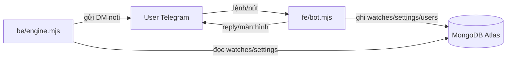
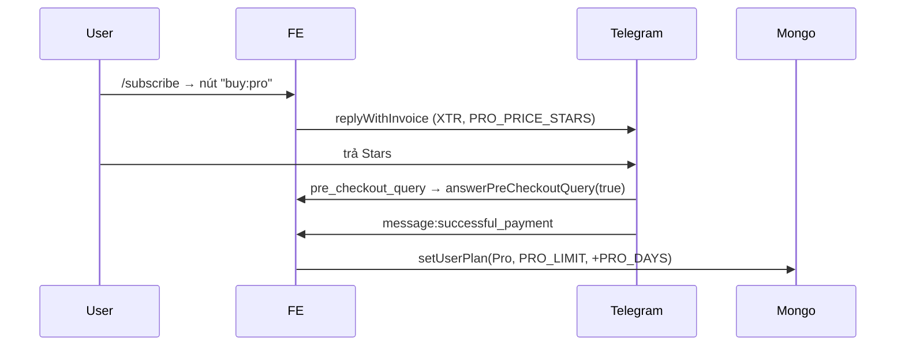

# Kiến trúc — FE (Telegram bot)

> **Vai trò:** toàn bộ UI/UX với người dùng trên Telegram. Nhận lệnh, quản lý watch-list,
> settings, gói cước, và các lệnh admin. **KHÔNG** đọc feed X — chỉ ghi/đọc trạng thái qua
> MongoDB; BE là bên gửi thông báo. FE và BE là **2 process Node riêng**, chỉ gặp nhau ở DB.

- **Entry:** [`fe/bot.mjs`](../fe/bot.mjs) — `npm run fe` / pm2 `kol-fe`
- **Framework:** [grammy](https://grammy.dev) (Telegram Bot API, long-polling)
- **Kết nối:** MongoDB Atlas (đọc/ghi state) + Telegram Bot API

---

## Bản đồ file

| File | Trách nhiệm |
|---|---|
| [`fe/bot.mjs`](../fe/bot.mjs) | Entry. Đăng ký command + callback router + payment + `setMyCommands`. |
| [`fe/screens.mjs`](../fe/screens.mjs) | Dựng text + inline keyboard cho từng màn (welcome, referral, settings, accounts, subscribe). |
| [`fe/xsearch.mjs`](../fe/xsearch.mjs) | `parseHandle` (username/link → handle) + `resolveHandle` (validate qua Bloom search). |
| [`shared/*`](../shared) | Dùng chung với BE — xem [ARCHITECTURE_BE.md](ARCHITECTURE_BE.md#shared--db). |

---

## Luồng lệnh

### Commands (user)
| Lệnh | Việc |
|---|---|
| `/start [payload]` | Màn chính. Deep-link: `?start=<tg_id>` = referral, `?start=qa+<handle>` = QA lookup. `ensureUser`. |
| `/add <user\|link>` | `parseHandle` → check `account_limit` theo tier → `resolveHandle` (Bloom search) → `addWatch` (settings=null, kế thừa global). |
| `/remove <user\|link>` | `parseHandle` → `removeWatch`. |
| `/accounts` | List watch-list. |
| `/settings` | Màn Global Settings (toggle edit-in-place). |
| `/support <message>` | Relay report vào **DM admin** (rate-limit 60s, cap 1000 ký tự). Không lưu DB. |
| `/subscribe` | Gói Pro (Telegram Stars). **Ẩn khi `SUBS_ENABLED != 1`**. |

### Commands (admin — ẩn với user khác)
| Lệnh | Việc |
|---|---|
| `/admin` | Liệt kê mọi lệnh admin + ví dụ. |
| `/grant <tg_id> [days]` | Cấp Pro (limit = `PRO_LIMIT`). |
| `/whitelist <tg_id> <limit> [days]` | Nâng hạn mức tuỳ chỉnh. limit 0 = hạ về Free. |
| `/unwhitelist <tg_id>` | Gỡ về Free. |

> Lệnh admin gate bằng `isAdmin(ctx.from.id)` (im lặng nếu không phải admin) **và** chỉ hiện
> trong menu của admin qua `setMyCommands` scope `{type:"chat", chat_id}`. User thường không thấy.

### Callback router
Một `bot.on("callback_query:data")` phân nhánh theo `data`:
- `home` · `viewAccounts` · `referrals` · `globalsettings` — điều hướng màn (edit-in-place).
- `tg:<key>` / `tw:<handle>:<key>` — toggle setting global / per-account. Đọc trạng thái từ DB rồi **đảo** (tránh race). Setting có `gate` → alert "not live / customers only".
- `subscribe` / `buy:pro` — mở màn gói / gửi invoice (gate `SUBS_ENABLED`).
- `del` — xoá chính tin noti (`ctx.deleteMessage`). Nút 🗑 Delete do BE gắn.
- `back` / `close`.

---

## Model 3 tier

| Tier | Hạn mức (`account_limit`) | Hạn dùng (`expires_at`) | Nguồn |
|---|---|---|---|
| **Free** | `FREE_LIMIT` | `null` → "Never" | mặc định lúc `ensureUser` |
| **Pro** | `PRO_LIMIT` | `now + PRO_DAYS` | thanh toán Stars / `/grant` |
| **Whitelist** | admin đặt | `null` (hoặc admin đặt) | `/whitelist` |

- `ensureUser` chỉ đồng bộ `account_limit` cho **Free** về `FREE_LIMIT`; Pro/Whitelist giữ nguyên.
- Hết hạn tính theo `expires_at` (không theo tier): có `expires_at` và đã qua → `EXPIRED`; không có → `Never`.
- `/add` chặn khi `countWatches >= account_limit`.

---

## Thanh toán (Telegram Stars)

- Provider token trống ⇒ thanh toán bằng **Stars** (currency `XTR`).
- `successful_payment` **luôn active** kể cả khi `SUBS_ENABLED=0` (honor invoice lỡ mở).
- Không có audit trail trong DB — đối soát qua Telegram `getStarTransactions`.

---

## Giao tiếp với BE
FE **không gọi** BE trực tiếp. Mọi thứ qua Mongo:
- FE ghi `watches`, `users.settings`, `users.tier/account_limit`.
- BE đọc chúng để quyết định gửi noti cho ai, lọc theo settings nào.
- Nút 🗑 Delete trên noti (BE gắn) → callback `del` → FE xoá tin.

---

## Cấu hình (env) liên quan FE
`BOT_TOKEN` · `ADMIN_IDS` · `MONGODB_URI` · `MONGODB_DB` · `SUPPORT_CONTACT` ·
`SUBS_ENABLED` · `PRO_PRICE_STARS` · `PRO_DAYS` · `PRO_LIMIT` · `FREE_LIMIT`.
Xem [`.env.example`](../.env.example).

## Chạy 1 instance duy nhất
Telegram long-polling: **chỉ 1 FE** được chạy trên 1 `BOT_TOKEN`, chạy 2 nơi → lỗi 409.
Deploy → tắt local (`pm2 delete all`) trước khi bật VPS.
